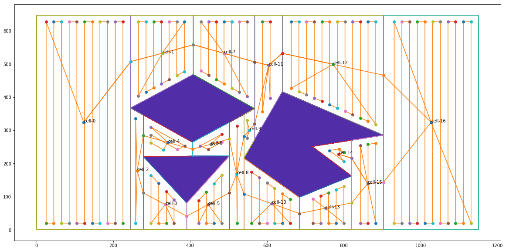
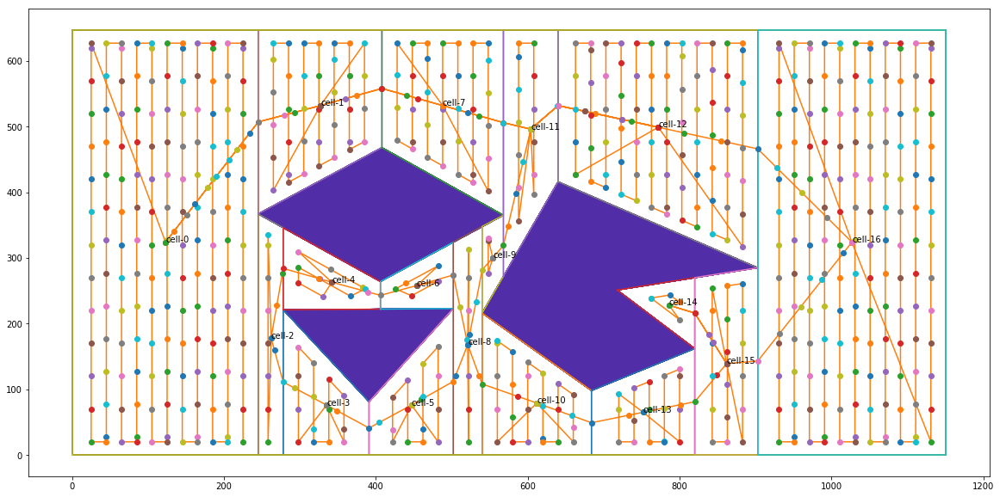

Our project is based on the cell decomposition from [Shikhar Dev Gupta](https://github.com/Shikherneo2/path-planning). We revise some codes and use these to solve the Complete Coverage Path Planning problem.

Specifically, we use the python package to solve the tsp problem, check [dmishin/tsp-solver
](https://github.com/dmishin/tsp-solver)

To generate the final path, run the following code:

`python generate_final_path.py img_file_name output_file_name width step safeWidth`

In our example:

`python generate_final_path.py "new_paint.png" "output.csv" 20 -1 20`

where `step` and `safewidth` could be set to `-1`, if you don't want to consider the step and safe width problem.

**Final path example**

**Final path example with step**

